# TypedSolid 設計

## 目的

意味情報と設計・製造ルールを持つプログラマブルなソリッドモデリング基盤を構築する。主用途は3Dプリント向けの筐体・支持具である。形状の生成だけでなく、部品の独立性、強度上の弱点、基板やコネクタの空間、組立・保守時のアクセスを検証対象にする。

新規B-Repカーネルは開発しない。Rustが意味付き中間表現（IR）とルール判定を管理し、Python APIから使用する。初期backendはCadQuery/OCCTとし、将来のbackend変更が公開モデル全体に波及しない境界を設ける。

## 要求と評価段階

| 要求 | 対応方針 | 初期実装 |
|---|---|---|
| 孤立パーツを避ける | 最終Boolean結果のsolid数を検査 | 対応 |
| 1 STL＝1部品 | 検査済みPartごとにSTL/STEPを出力 | 対応 |
| 出力STLが閉じた立体である | 書き出したmeshのmanifold性、向き、連結成分、体積を検査 | 対応 |
| 細く折れやすい箇所を減らす | primitive寸法、最終肉厚、接続部断面、荷重・積層方向を段階的に評価 | primitive寸法、最終肉厚、接続部断面 |
| 閉じた空洞を避ける | 最終形状の空領域が外部へ通じているかを検査 | 対応 |
| 基板等のスペース確保 | clearanceで拡張したkeepoutと最終形状の交差体積を評価 | 軸平行box、面ごとのclearance |
| アクセスの確保 | 部品・工具の移動領域と形状の干渉検査 | 全部品に対する6方向の直線経路 |
| ネジ固定 | ネジ・インサートの寸法と実形状の整合を検査 | 貫通穴、座面、かかり長さ、先端の逃げ、bossの肉厚 |
| snap fit | 梁のひずみ、積層方向、たわむ空間、保持、外れる経路を検査 | 矩形断面の片持ち梁 |
| サポート不要化 | 印刷方向、overhang、bridge、閉空洞、層ごとの島を評価 | 印刷方向、overhang、bridge |
| 応力・熱解析 | 材料、境界条件、解析mesh、solverの条件を明示して連携 | 未対応 |

「中空を減らす」は内部を一律に埋める規則にはしない。基板空間・軽量化・放熱と競合するため、閉じた空洞や支持のない天井を制約し、必要な開放空間を保持する。infill率はslicer設定であり、CADの空洞と区別する。

## 境界と責務

| 層 | 責務 | 持たない責務 |
|---|---|---|
| Python API | typed dataclassによるモデル組立、serialization、部品catalog | 検証の独自再実装 |
| Rust core | schema、単位、ID、role、入力検証、preflight、出力判定 | OCCTオブジェクト保持 |
| PyO3 binding | JSON境界でcoreを呼ぶ | CAD処理 |
| CadQuery backend | IR→形状、最終solid・干渉検査、STL/STEP出力 | 未対応ルールの合格判定 |

JSONは初期のFFI・保存境界であり、Python scriptの文字列を評価しない。今後の性能測定で問題になるまで、独自の複雑なFFIオブジェクト共有を導入しない。

部品catalogはIRを組み立てるための寸法データであり、検証には関与しない。catalogが返す`Keepout`と`Feature`は手で書いたものと区別されず、同じRust coreの検証を通る。値はすべて公式資料が寸法線として与える数値に限り、記載のない項目は`None`として利用側に指定を求める。詳細は [部品catalog](catalog.md) を参照する。

## IR v9

- 長さはmm。座標は右手系で全Part共通、+Zを上方とする。回転・配置変換はまだ扱わない。
- `Model`は`schema_version=9`、`parts`、`keepouts`、`sweeps`、`assembly`、`fasteners`、`materials`、`snap_fits`、`connectors`、`policy`を持つ。
- `Part`は単独の製造部品。`Feature`のIDはPart内で一意、Part IDとKeepout IDは各名前空間内で一意とする。
- `Feature`は`shape`、`role`、`operation`を持つ。roleは`base/wall/mount/rib/generic`。roleだけで強度を保証しない。
- `shape`は`kind`で分岐する。`box`は`min`/`max`、`cylinder`は`axis`、軸に垂直な平面上の`center`、`radius`、軸方向の`span`を持つ。cylinderは軸平行に限る。任意軸は配置変換とあわせて後続項目とする。
- 穴は`operation=cut`のcylinder、bossは`add`のcylinderで表す。面取り・filletはOCCTのedge選択に依存するため導入しない。
- Booleanの意味は「すべてのAddの和から、すべてのCutを引く」。記述順依存の逐次CSGではない。Cutは生成用であり、最小feature寸法ルールの対象外。
- 最小feature寸法はprimitiveの寸法を測る。cylinderは直径と高さの小さい方とする。
- `Keepout`は確保領域と面ごとのclearanceを持つ。`clearance_mm`は`default`と面名 (`minus_x`等) の上書きからなる。支持面へ接触させる面だけを0にでき、他の面の要求は残る。
- keepoutはboxに限る。面別clearanceと、それを掃引に使うkeepout参照はboxの面を前提とするため、cylinderのkeepoutは受理しない。
- `Keepout.attached_to`は、基板などが固定されている部品のidである。keepoutは分解経路の障害物となり、取付先の部品を動かすstepではその部品と一緒に動き、以降の状態から除かれる。省略すると外部に固定され、最後まで残る。
- `Sweep`は工具・ケーブル・コネクタ、またはkeepoutを取り出す際に通る領域を表す。形状は`shape` (boxか軸平行cylinder) で直接与えるか、`keepout`を参照してそのclearance込みのboxを使う。どちらか一方に限る。`direction`、`distance_mm` (正の数値か`"exit"`) を持つ。形状は包絡であり、指の入る余地などの余裕を含める。掃引自体はclearanceを持たない。
- `after_step`を与えた掃引は、そのstepを終えた状態で評価し、取り外した部品は障害物にならない。省略すると組立完了の状態で評価する。USBは蓋を閉じたまま抜き差しでき、ネジは蓋を外してから締める、といった区別をこれで表す。
- IDは小文字ASCII英字で始まり、小文字英数字とunderscoreのみ、64文字以内。path traversalとWindows予約名を拒否する。
- `Policy`は`min_feature_mm`のほか、最終形状の検査に`voxel_mm`、`min_wall_mm`、`min_neck_mm`、`build_direction`、`overhang_angle_deg`、`bridge_max_mm`を持つ。primitiveの寸法と最終形状の肉厚は別の概念であり、要求値も分けて指定する。
- `assembly`は分解手順を持つ。IRに記述した部品位置を組立完了の状態とし、`steps`を順に実行して分解する。各stepは`parts`を一体として、軸平行の直線区間を連ねた`path`に沿って動かし、以降の状態から除く。組立順序は分解の逆とする。どのstepにも現れない部品は最後まで残る。
- 区間の`distance_mm`は正の数値か`"exit"`とする。`"exit"`は残っている部品のAABBの外へ2 mmの余裕をもって出る距離を表し、最後の区間に限る。
- `fit_clearance_mm`は移動方向に垂直な向きに要求する隙間で、`assembly`の値をstepごとに上書きできる。既定の0は硬い干渉だけを見る。
- `Fastener`はネジ1本の固定を表し、`clamp`の部品を`base`の部品へ締める。`direction`は締め込む向き (頭から先端へ)、`center`は軸に垂直な面上の座標、`seat_mm`は頭の座面、`joint_mm`はclampとbaseの境目の軸方向の座標である。`screw`は長さ (座面から先端)、ねじ部の外径、頭の外径を、`through_mm`はclampの貫通穴の径を持つ。`anchor`は`self_tapping` (`pilot_mm`: 下穴径) か`insert` (`hole_mm`: 圧入前の下穴径、`length_mm`: インサート長。境目と面一に埋める) である。要求値として`min_engagement_mm`と`min_boss_wall_mm`を持つ。
- ネジ・インサートの寸法と要求値に既定値はなく、利用者が規格表や実測から与える。Rust coreは、外径 ≤ 貫通穴径 < 頭径、下穴径 < 外径 (セルフタップ)、インサート下穴径 > 外径、座面から見て境目が締め込む向きにあることを検証する。`clamp`が空の場合、締める対象は部品として記述されていない (基板など) ことを表し、座面と境目は一致してよい。
- `Material`は`id`、`name`、`source` (値の出典) と、曲げの許容ひずみ`allowable_strain` (無次元、0〜1) を持つ。`Part`は`material`でidを参照する。材料の値に既定値はない。材料定数はM3の解析で追加する。印刷機と設計値 (Pythonの`Printer`と`Profile`) はIRに入れず、`Policy`とはめ合い隙間を作る入力に留める。
- `SnapFit`は矩形断面の片持ち梁によるsnap fitを表す。`part`の2つのadd box feature を`beam`と`hook`として参照し、`length_direction` (梁の根元から先端への向き)、`deflection` (外すときにフックが動く向き)、`deflection_mm`、フックが掛かる`mate`、外す分解`step`を持つ。梁の寸法はboxから求め、IRに重ねて持たない。
- Rust coreは次を検証する: `part`の材料に`allowable_strain`がある、`beam`と`hook`が異なるadd boxである、たわむ向きが長さ方向に垂直である、フックが梁に接し梁の長さの範囲にあり根元から離れている、`step`が`part`と`mate`の一方だけを動かし、両者ともそれ以前のstepで取り外されていない。
- `Connector`は筐体の壁に開けるコネクタ開口を表す。`part`のcut boxの`opening`、プラグを抜く`sweep` (box形状)、抜く向きに垂直なプラグ断面`plug_mm` (並びはcylinderの`center`と同じ軸順)、開口とプラグの間に各辺で要求する`clearance_mm`、値の出典`source`を持つ。`source`は`kind` (`datasheet`、`measured`、`other`) と`reference` (1〜500文字) からなる。プラグ寸法に既定値はなく、利用者が与える。
- 座標±1,000,000 mm、primitive寸法0.001 mm以上、100部品・100keepout・1000掃引・1000ネジ固定・100材料・1000 snap fit・1000コネクタ開口・合計1000feature・100 step・1 stepあたり16区間・JSON 1 MB以内、1部品あたりvoxel 2億cell以内を実装上の上限とする。これらはプリンタ能力の保証値ではない。

### 旧版からの昇格

`schema_version`が1〜8のJSONは、読み込み時に順に昇格してv9へ変換する。いずれも対応は一意に定まる。

- v1→v2: v1は軸平行box、一様clearance、単一accessだけを表現できる。`bounds`は`shape`の`kind=box`へ、数値の`clearance_mm`は`{"default": n}`へ、`access`の文字列は1要素の配列へ、`null`は空配列へ移す。
- v2→v3: v2は分解手順を持たないため、空の`assembly`を補う。v2の入力に`assembly`が現れた場合は拒否する。
- v3→v4: keepoutの`access`の各方向を、組立完了の状態で外まで抜く`Sweep`へ移す。idは`<keepout>_<direction>`とし、idの規則を満たさない場合は昇格を拒否してkeepout idの短縮を求める。v3の入力に`sweeps`が現れた場合は拒否する。
- v4→v5: v4はネジ固定を持たないため、空の`fasteners`を補う。v4の入力に`fasteners`が現れた場合は拒否する。
- v5→v6: v5は材料とsnap fitを持たないため、空の`materials`と`snap_fits`を補う。部品の`material`は省略可能であり、v5の部品はそのまま読める。v5の入力にこれらが現れた場合は拒否する。
- v6→v7: v6のkeepoutは取付先を持たないため、外部に固定されたものとしてそのまま受理する。v7からkeepoutは分解の障害物となるため、同じモデルでも`disassembly_path`の判定が厳しくなる場合がある。v6の入力に`attached_to`が現れた場合は拒否する。
- v7→v8: v7のネジは外す状態と締めるkeepoutを持たないため、外さないネジとしてそのまま受理する。v8で必須になる`fastener_release`は、ネジで留めた部品を引き離す分解stepがあると落ちる。v7の入力に`release`か`clamp_keepouts`が現れた場合は拒否する。
- v8→v9: v8はコネクタ開口を持たないため、空の`connectors`を補う。v8の入力に`connectors`が現れた場合は拒否する。

出力は常にv9で、旧版では書き出さない。Python APIの`Keepout(access=...)`は、`to_json`が同じ規則で`Sweep`へ展開する省略形として残す。

## 検査と出力

検査は`pass / fail / not_evaluated`の3状態とし、rule ID・target ID・理由を保持する。1件でもfailがある場合、またはrequiredルールが全件passでない場合、出力を拒否する。preflightだけでは標準policyの出力条件を満たさない。

標準policyは`feature_thickness/valid_solid/single_solid/keepout_clearance/access_clearance/part_interference/final_wall_thickness/neck_section/closed_cavity/support_free/disassembly_path/disassembly_separation/fastener_fit/snap_fit/fastener_release/connector_fit`を必須とする。`mesh_manifold/mesh_volume`はexport時に評価され、failがあれば出力を拒否する。適用対象がないkeepout・掃引・部品間干渉・分解・ネジ固定・snap fit・コネクタ開口の検査は「宣言された対象なし」と明示する。未宣言の基板・工具が存在しないことは保証しない。

`strength/thermal`は常にnot_evaluatedである。requiredに指定した場合は出力を拒否する。標準policyでの出力許可は「実装済み検査を満たした」の意味であり、印刷・構造安全の認証ではない。

交差体積は1e-7 mm³を許容差とし、面接触は許容する。印刷公差や嵌合clearanceと、この数値誤差の許容差を混同しない。極小の干渉、STL meshのmanifold性、slicer上の層島・bridge・supportは別の検査が必要である。

`valid_solid`の空判定には接触判定の許容差を流用せず、1e-12 mm³を下限とする。最小box寸法0.001 mmの立方体は1e-9 mm³であり、接触許容差を空判定に使うと正当な最小形状を無効と扱うためである。

## 検出箇所と図

failしたcheckは、検出箇所を軸平行のbox (`locations`、単位mm) で持つ。passのcheckと、位置を持たないruleのcheckでは省略する。1つのcheckにつき大きい順に20件までとし、総数はmessageの末尾 (`N location(s)`) に書く。

| rule | 検出箇所 |
| --- | --- |
| `final_wall_thickness` | 薄肉と判定した領域の連結成分ごとの外接box |
| `neck_section` | erosionで残った成分から材料の内部を幅優先で同時に広げ、異なる成分の前線が出会うcellの連結成分。断面の幅の半分だけ広げる。材料で繋がらない成分は前線が出会わないため、最大の成分以外を示す。材料が残らない場合は部品全体 |
| `closed_cavity` | 外部に通じない空cellの連結成分ごとの外接box |
| `support_free` | 支持もbridgeも得られないcellの連結成分ごとの外接box |
| `connector_fit` | 開口と、掃引前のプラグのbox |
| `single_solid` | solidごとの外接box。最大のものが本体である |
| `part_interference` | 2部品の共通部分のsolidごとの外接box |
| `keepout_clearance` | 部品と、clearanceで広げたkeepoutの共通部分 |
| `access_clearance` | 掃引領域と部品の共通部分 |
| `disassembly_path` | 動かす部品の掃引領域と障害物の共通部分。障害物の組立位置にある |
| `disassembly_separation` | 最後の区間の延長で塞ぐ障害物との共通部分 |
| `fastener_fit` | `through`と`clear_tip`は穴やネジの経路にある材料、`bearing`と`boss_wall`は輪帯のうち材料のない部分、`engagement`は要求されるかかり長さの範囲のネジ |
| `snap_fit` | `beam`は梁とフックのboxのうち材料のない部分、`deflection_space`はたわむ空間と障害物の共通部分、`retention`は保持しないフック |

OCCTで判定するruleの検出箇所は、判定に使ったBooleanの結果 (共通部分、または要求領域から材料を引いた残り) のsolidごとの外接boxである。体積の大きい順に並べ、座標は小数点以下6桁に丸める。`valid_solid`は部品全体の妥当性であり、検出箇所を持たない。寸法だけで判定する`snap_fit`の`strain`と`layer`、`fastener_release`も同様である。

**断面図**: `figures/`に、部品ごとの概観と、failしたcheckの検出箇所 (各checkの大きい順に3件) を通るx、y、zの3断面をSVGで書く。図は判定と同じvoxel格子とmaskから描くため、塗った箇所は判定の根拠そのものである。格子より細かい形状は図にも現れない。凡例の色は、赤が薄肉、紫が細い接続部、青が未支持、橙が閉空洞で、灰色が材料、破線が検出箇所のboxである。断面はRust coreが各cellのbit (材料、薄肉、接続部、未支持、閉空洞) を返し、PythonがSVGに描く。SVGの生成は標準libraryだけで行い、CadQueryに依存しない。

| 欠陥 | 図 |
| --- | --- |
| 薄肉 (`thin_wall`) | 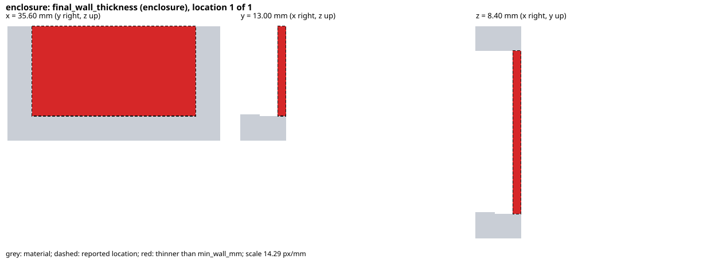 |
| 細い接続部 (`narrow_neck`) | 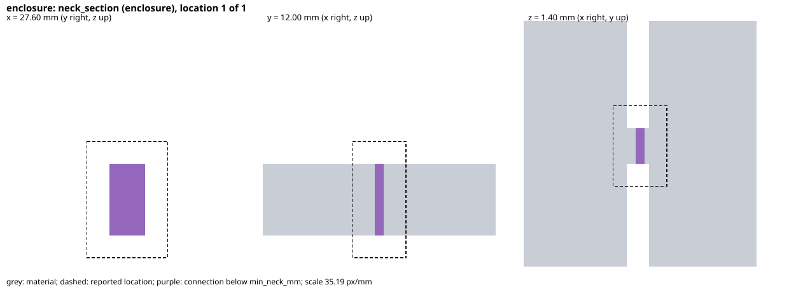 |
| 切り離された部分 (`severed_corner`) | 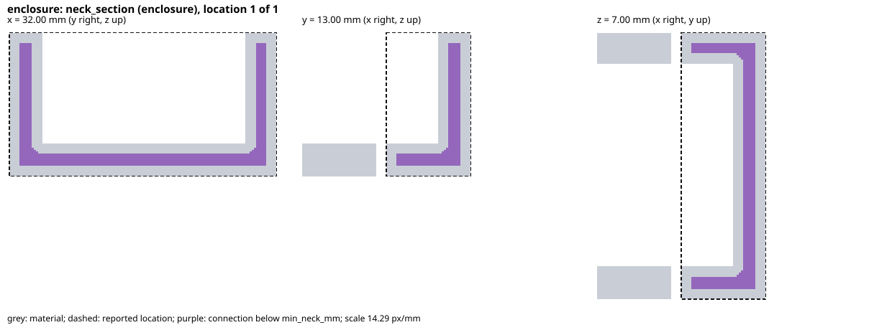 |
| 支持のない張り出し (`cantilever`) | 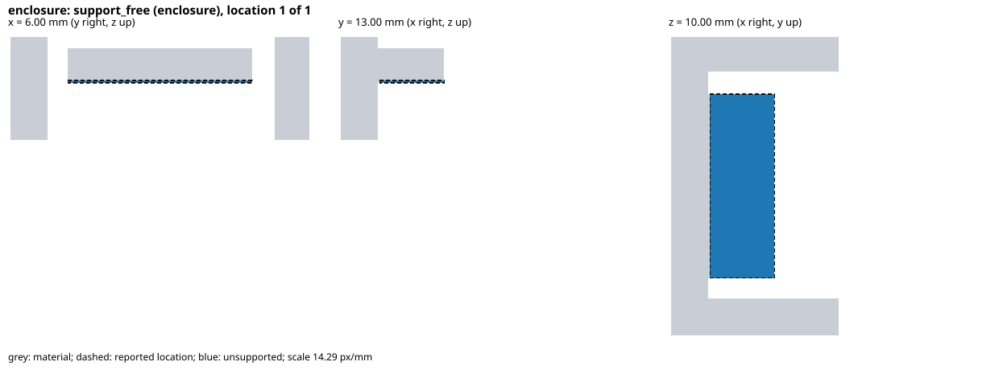 |
| 閉空洞 (`sealed_void`) | 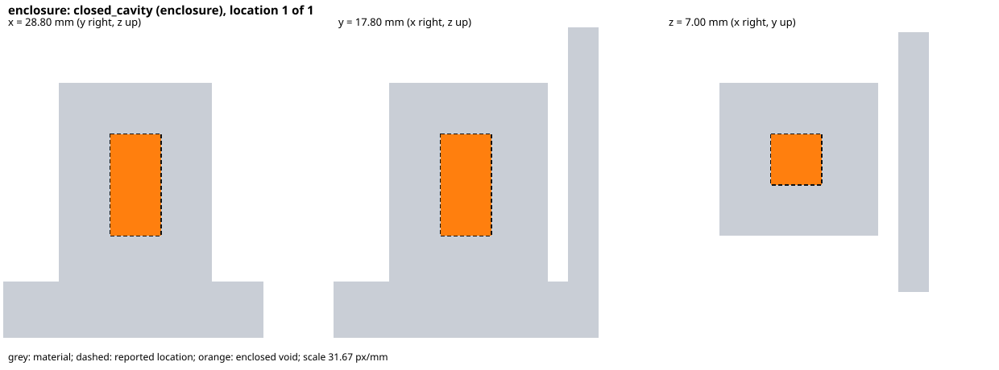 |

図は`scripts/render-figures.py --output docs/assets/figures --defects-only`で再生成する。

**投影図**: `figures/projection/`に、組立状態の全部品の概観 (`overview.svg`) と、検出箇所を持つfailしたcheckごとの図を書く。図は平面図、等角図、正面図、右側面図を同じ縮尺で2×2に並べる。部品の線はOCCTの隠線処理 (HLR) で求め、見える線を実線、隠れる線を破線で描く。検出箇所 (赤) とkeepoutの箱 (緑、clearanceを含まない) は隠線処理をせずに同じ投影で描く。検出箇所は部品の内部にあることが多いためである。部品の隠線処理は方向ごとに1回だけ行い、図ごとに使い回す。断面図と異なりvoxel格子を経由しないため、格子より細かい形状も現れる。backendが例外で止まった場合は形状がなく、投影図を書かない。cutで材料が残らない部品は外接boxを持たないため描かず、そのような部品しかなければ投影図を書かない。この場合もreportと断面図は書く。`build`の結果からは`typedsolid.cadquery.write_projection_figures`で書ける。

| 欠陥 | 図 |
| --- | --- |
| 蓋が壁に食い込む (`lid_overlap`) | 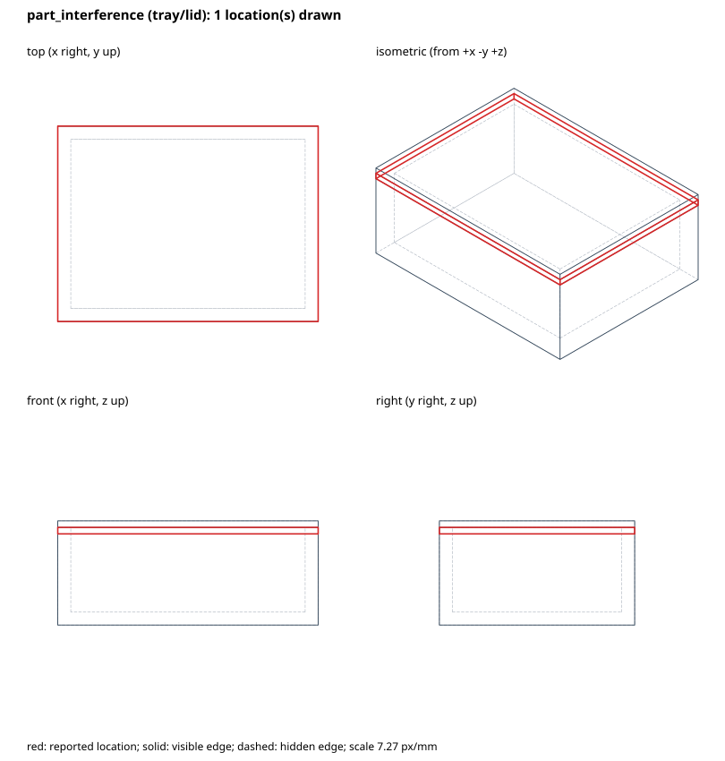 |
| ケーブルの経路を壁が塞ぐ (`blocked_cable`) | 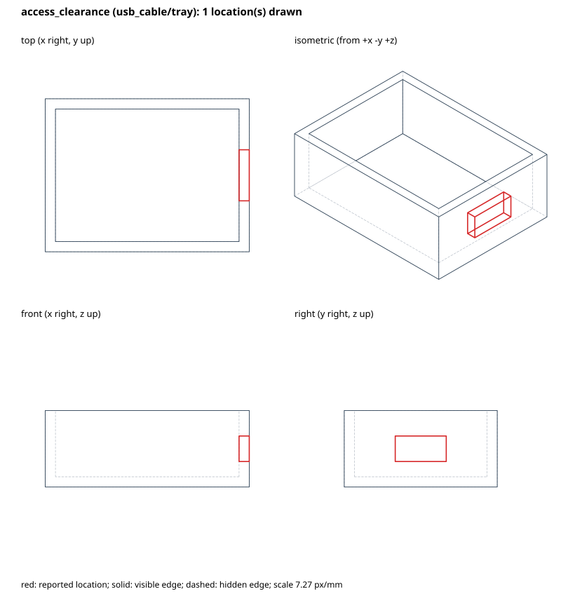 |
| 柱が基板の確保領域に入る (`post_in_keepout`) | 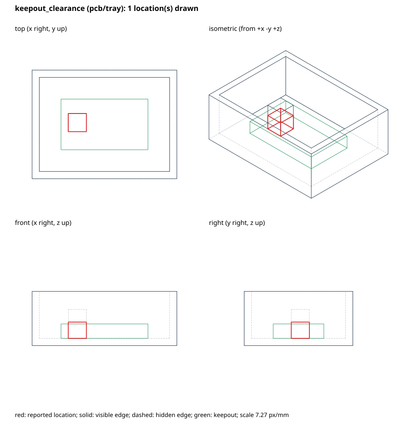 |
| 引き抜く板を壁が塞ぐ (`sliding_lid`) | 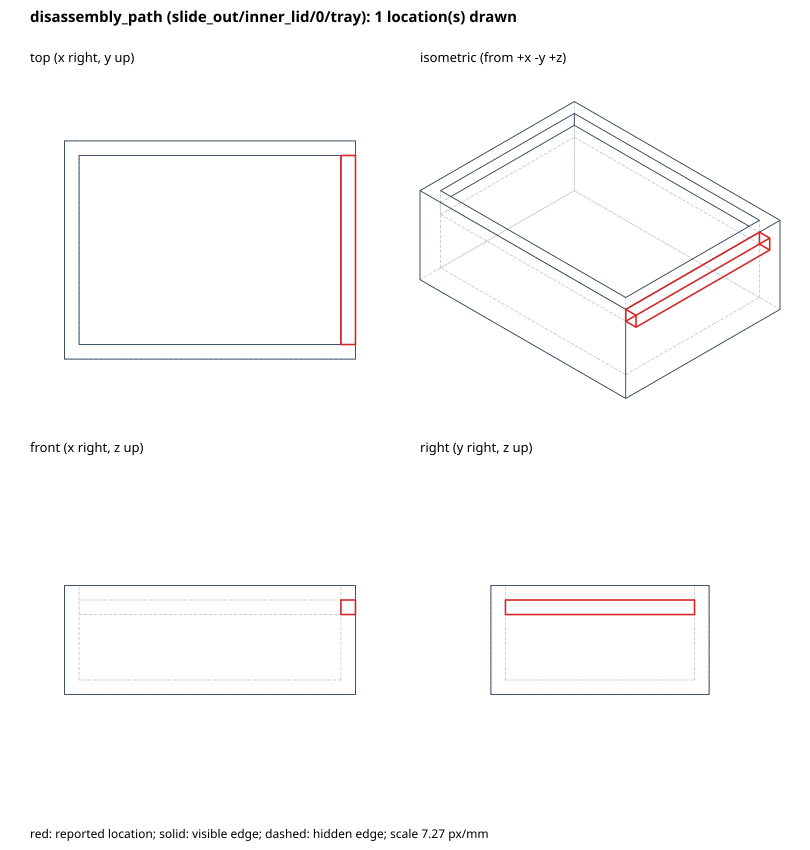 |

fixtureは`examples/assembly_defects.py`が持ち、`tests/test_projection.py`が落ちるruleと検出箇所の座標を照合する。図は`scripts/render-projections.py --output docs/assets/projections`で再生成する。CIのintegration jobが再生成してdocsの図と比べる。

**出力の拒否と図**: `export`は検査で出力を拒否した場合も出力先を作らない。代わりに、reportと図だけを隣の`<出力先>.rejected/`に書き、例外にその場所を注記する。STL/STEPは書かない。`<出力先>.rejected/`が既にある場合は置き換えず、その旨を注記する。`export(..., figures=False)`で図を省ける。

第三者の筐体の図は、形状の派生画像となるため文書に載せない。利用者が手元で`typedsolid.external`の`--figures`を使って確かめる。

### 3D viewer

`export`は`figures/viewer.html`に、部品のmesh、keepout、全checkと検出箇所を埋め込んだ1つのHTMLを書く。外部の資源を読まず、`file://`のまま開ける。描画は自作のWebGL 1で行い、JavaScriptのpackageに依存しない。meshは最終形状をOCCTで三角形に分割したもので、許容誤差は部品全体の外接boxの対角長の0.1%である。描ける部品がない場合も、checkの一覧を見るために書く。拒否した出力でも`.rejected/`に残る。

- **check**: 状態 (fail と not evaluated、fail、not evaluated、pass、すべて)、rule、文字列 (rule、target、message の部分一致) で絞り込み、状態、rule、target、検出箇所の数で並べ替える。checkを選ぶとmessageと検出箇所の座標を示し、その検出箇所だけを赤く描く。選ばない間はfailしたcheckの検出箇所をすべて描く。画面上の赤い箱をclickすると、そのcheckを選ぶ。
- **注視**: 検出箇所の`focus`で、その箇所を中心に、周囲を含む距離へ視点を寄せ、箇所を半透明の赤で塗る。
- **部品**: 部品ごとに表示と半透明を切り替える。検出箇所は部品の内部にあることが多いため、深度によらず手前に描く。keepoutは緑の線 (clearanceを含まない) で描く。
- **断面**: x、y、zのいずれかの平面より正の側 (反転で負の側) を描かない。切り口から見える部品の内面を灰色で描く。断面のcapは描かない。
- **操作**: dragで回転、右dragまたはshift+dragで平行移動、wheelまたはpinchで拡大する。

表示状態はURL fragmentに書く。例えば`viewer.html#check=12&loc=0&clip=z:8&ghost=tray`は、12番目 (0始まり、reportの順) のcheckを選び、その最初の検出箇所を注視し、z=8 mmで切り、`tray`を半透明にした表示である。同じURLを開くと同じ表示になり、利用者間で表示を共有できる。平行移動は記録しない。

DOMとWebGLに依存しない処理 (行列、データの復号、fragmentの解釈と書き出し、checkの絞り込みと並べ替え、picking) は`viewer_core.js`に分け、`tests/js/`のnode:testで検査する。描画は`scripts/check-viewer.py`が部品間の欠陥fixtureを版を固定したChromiumで撮影し、表示状態ごとに部品、検出箇所、断面の色が画面に現れることを確かめる。

| 表示 | 画像 |
| --- | --- |
| checkの選択と部品の半透明 (`post_in_keepout`) | 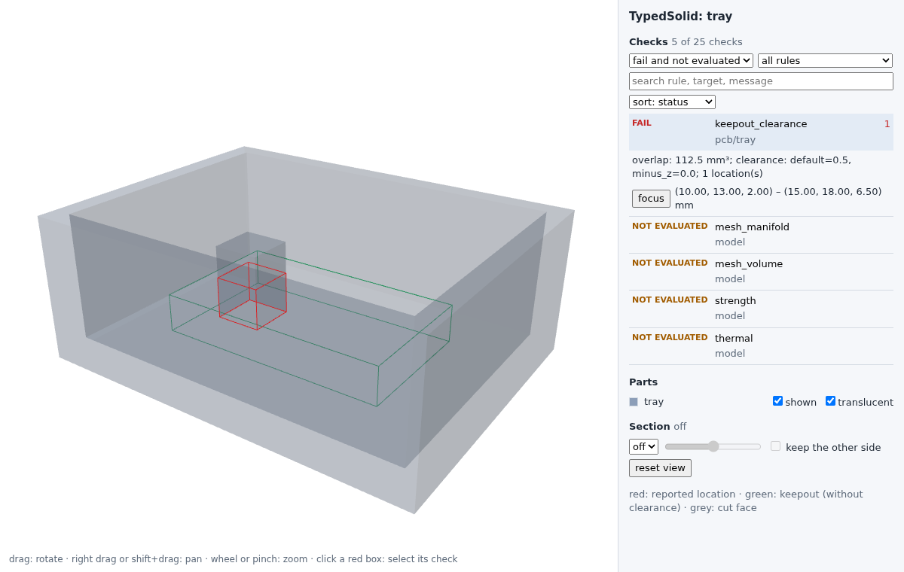 |
| z方向の断面 (`lid_overlap`) | 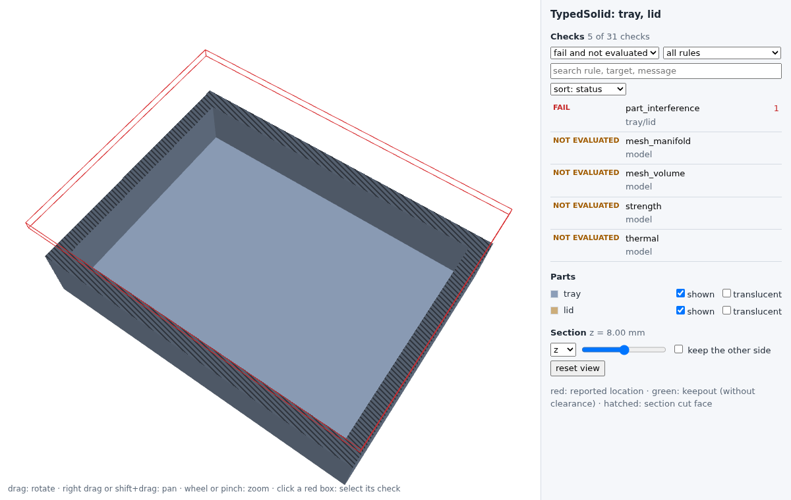 |
| 複数の欠陥を持つ2部品の筐体の概観 (`pi4_enclosure_defects`) | 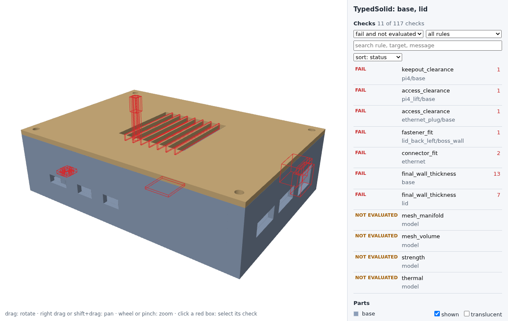 |

**Raspberry Pi 4の筐体**: `examples/pi4_enclosure.py`は、部品catalogのRaspberry Pi 4 Model Bの外形、取付穴、コネクタ位置から作る底と蓋の2部品の筐体である。蓋を四隅の柱へ4本のネジで、基板を底の4本のbossへネジで締め、底の壁に6個のコネクタ開口と、プラグを抜く掃引を持つ。蓋には通気スリットを開ける。基板の高さ、PCBの厚み、コネクタの高さとプラグの断面、ネジの寸法、bridgeで渡せる長さ (15 mm) は作例が決めた説明用の値である。正常版 (`pi4_enclosure`) はすべてのruleを通り、部品間の検査はいずれも実際の対象で評価される。欠陥版 (`pi4_enclosure_defects`) は、蓋の通気スリットの桟、床の削り込み、細いネジ柱、基板のbossに載せたshim、下へずらしたEthernetの開口の5つの欠陥を同時に持ち、2部品にまたがって6 ruleの7 checkが落ちる。`tests/test_pi4_enclosure.py`が落ちる集合を照合し、`scripts/check-viewer.py`が欠陥版のviewerを撮影する。

snap fitは持たない。IRは印刷方向をmodel全体で1つだけ持つため、蓋から垂らす梁は積層方向に沿い、正常な設計でも`snap_fit`の積層方向の検査に落ちる。部品ごとの印刷姿勢は後続の課題である。

## 着脱の検査

分解stepごとに、動かす部品の最終形状を区間ごとに掃引し、残っている部品との共通体積を求める。判定はOCCTのBooleanで行う。はめ合い隙間は0.2〜0.3 mm程度でvoxelの既定pitchと同じ桁にあり、量子化を失敗側に倒すと正しい設計まで落ちるためである。

| rule | 内容 |
| --- | --- |
| `disassembly_path` | 各区間の掃引体積が、残っている部品と共通体積を持たない |
| `disassembly_separation` | 最後の区間の方向へ外まで動かし続けても干渉しない。部品が経路の終端で外れていることを表す |

**keepout**は箱そのもの (clearanceを含まない) を障害物とする。clearanceは静止状態での設計余裕として`keepout_clearance`だけで使い、移動中の隙間は`fit_clearance_mm`で見る。両方を適用すると余裕を二重に取ることになるためである。取付先の部品を動かすstepでは、keepoutはその部品と一緒に動き、他の部品や残っているkeepoutとの干渉を検査する。targetでは`keepout:<id>`と書き、部品のidと区別する。`"exit"`の距離は残っているkeepoutの外までを含む。

`disassembly_separation`はAABBの分離では判定しない。L字の土台の切り欠きから横へ抜く場合のように、外れた部品がAABBの内側に残る形があるためである。

**はめ合い隙間**は距離ではなく体積で判定する。最短距離では、蓋が壁の上に載る接触も距離0となり、正しい設計まで落ちる。動かす部品を移動方向に垂直な2軸にだけ`fit_clearance_mm`広げてから掃引し、共通体積を見る。移動方向の手前にある載置面の接触は体積0のまま残り、横ですれ違う面の隙間不足だけが検出される。広げる形は辺長2·clearanceの正方形とのMinkowski和で、円とのMinkowski和より保守的である。

隙間の要求は移動方向に平行な面すべてに掛かる。スライドする蓋が載っている面を滑る場合、その面も隙間を要求される。載置面を滑る区間を持つstepでは、そのstepの`fit_clearance_mm`を0とする。

**掃引体積**は、元の形状、終点の形状、移動方向と平行でない各faceのprismの和として作る。OCCTはsolidのprismを扱わない。境界を横切る線分は移動方向と交差するfaceを通るため、この和は測度0の差を除いて掃引体積に一致する。閉じた円筒面を垂直方向に押し出すと自己交差するため、円筒軸を通り移動方向に垂直な平面で先に分割し、各半面の法線が移動方向に対して一定の向きを持つようにする。cutを反映した最終形状そのものを掃引するため、蓋の穴を柱が通る形も正しく扱う。穴あき板と円柱の掃引体積が解析値と小数第6位まで一致することをtestで確認している。

## 掃引の検査

`access_clearance`は各掃引の領域が、その状態で残っている部品と共通体積を持たないことを見る。掃引体積は着脱の検査と同じ関数で作る。`"exit"`は残っている部品のAABBの外へ2 mmの余裕をもって出る距離である。keepoutを参照する掃引は、v3までのaccessと同じくclearance込みのboxを外まで動かす。

掃引は部品だけを障害物とし、keepoutを障害物としない。USBプラグのように、keepoutとして確保した基板上のコネクタへ差し込む掃引があるためである。keepoutを参照する掃引は、そのkeepoutが評価する状態で残っていることを要求する。取付先の部品を`after_step`までに外している場合は、keepoutも一緒に取り除かれているため、検証で拒否する。

## ネジ固定の検査

`fastener_fit`は組立完了の状態で、ネジ1本ごとに次の5項目を`<fastener>/<項目>`のtargetで報告する。判定は着脱と同じくOCCTのBooleanで行う。下穴の径とねじ山の差は0.3〜0.5 mm程度で、voxelの量子化に埋もれるためである。

| 項目 | 内容 |
| --- | --- |
| `through` | 座面から境目まで、貫通穴径の円柱にclampの材料がない。ネジがclampに噛むと締め付けにならないため、外径でなく貫通穴径で見る |
| `bearing` | 貫通穴径から頭径までの輪帯が、座面から0.5 mm (clampがそれより薄ければその厚み) clampの材料で埋まっている |
| `engagement` | セルフタップは、境目から先端までの下穴径〜外径の輪帯とbaseの共通体積を輪帯の断面積で割った長さ。インサートは、境目を越えたネジの長さとインサート長の小さい方。いずれも`min_engagement_mm`以上 |
| `clear_tip` | 下穴 (インサートの場合はインサート穴と、その先のネジ外径の経路) にbaseの材料がない。先端が底に当たると締め付けにならない |
| `boss_wall` | 下穴径またはインサート穴径の周囲`min_boss_wall_mm`の輪帯が、ねじ山のかかる範囲 (インサートはインサート長) でbaseの材料で埋まっている |

「材料で埋まっている」は、不足体積が1e-7 mm³と期待体積の1e-6倍の大きい方以下であることとする。円筒面が一致する境界の演算誤差を吸収するためであり、穴や肉の寸法不足を許す値ではない。

`clamp`が空の場合、`through`と`bearing`は対象が記述されていないことを明記してpassとする。ネジが境目を越えない場合、`boss_wall`は評価範囲がないため`not_evaluated`とし、出力を拒否する。

### ネジを外す順序

`Fastener.release`はネジを外す状態を表す。`{"after_step": "open_lid"}`はそのstepを終えた状態で、`{}`は組立完了の状態で外す。省略するとネジは外さない。`Sweep.after_step`と同じ状態の表し方であり、蓋を外した後にネジを外して基板を抜く、といった手順を書ける。`Fastener.clamp_keepouts`は、ネジで締めているkeepout (基板など部品として記述しない物) である。

`fastener_release`は、ネジ1本ごとに`<fastener>/release`で次を見る。形状を使わないため、Rust coreが判定する。

- ネジを外すより前のstepで、base、clampの部品、締めているkeepoutのいずれかを他と別々に動かさない。keepoutは取付先の部品と一緒に動く。全員を同じstepで動かすことは許す。
- 締めているkeepoutを取り出す`Sweep`を、ネジを外す前の状態で評価しない。

`screw_fixing`に`release`を与えると、ドライバの掃引をネジを外す状態で作る。

検査するのは宣言した寸法と形状の整合であり、締結力、ねじ山の強度、インサートの引き抜き強度は評価しない。ドライバの通り道は`Sweep`として別に宣言し、`access_clearance`で検査する。Python APIの`screw_fixing`は、bossと下穴、貫通穴、ドライバの掃引、`Fastener`を同じ寸法から作る。

## 最終形状の検査

`final_wall_thickness`、`neck_section`、`closed_cavity`、`support_free`はIRから直接rasterizeしたvoxel上で判定する。OCCTのface/edge topologyに依存せず、boxとcylinderの内外判定だけで最終形状を得る。Boolean後のface対応を推測しないという方針と整合する。

格子の間隔は`policy.voxel_mm` (既定0.2 mm)、cell数の上限は1 partあたり2億である。上限を超える入力はvalidateで拒否する。cellはvoxel中心で内外を判定するため、形状は最大で格子の半分だけ外側へ膨らむ。要求値に格子1つ分を足して判定し、量子化の誤差を失敗側へ倒す。格子より小さい形状は評価できず、`neck_section`がfailするため出力は拒否される。

- `final_wall_thickness`: 各cellを通る軸方向の連続長のうち最小のものを厚さとする。扱うprimitiveは軸平行に限るため、壁は必ずいずれかの軸に沿って厚さを持つ。球のopeningで測ると角や稜線が必ず除去され、十分に厚い立体まで薄肉と判定されるため採らない。面の縁や稜線は必ず薄くなるので、一辺`min_wall_mm`の立方体に満たない領域は形状の縁として数えない。
- `neck_section`: 半径`min_neck_mm / 2`でerosionし、6-連結の連結成分が1つに保たれるかを見る。分かれる場合は、その断面で繋がる細い接続部がある。距離場はFelzenszwalb-Huttenlocherの下位包絡線法で求める厳密なEuclidean距離であり、chamfer近似のような方向依存の誤差を持たない。
- `closed_cavity`: 空cellを格子の外周から6-連結でflood fillし、到達できない空領域を閉空洞とする。格子より細い隙間を通じて外部に通じる空洞は、閉じていると判定される。
- `support_free`: `policy.build_direction` (既定`plus_z`) の軸で層に分け、各層のcellが直下の層の半径`tan(overhang_angle_deg)` cell以内に材料を持つかを見る。材料が最初に現れる層はbuild plateに接するものとして支持済みとする。直下が支持されているかは問わない。支持の要否は層ごとに独立して評価し、1箇所のoverhangがその上の全体を未支持にすることを避ける。未支持のcellは、同じ層で両端を支持された材料に挟まれ、区間長が`bridge_max_mm`以内であればbridgeとして渡せるものとする。端で終わる区間は片持ちでありbridgeにならない。

`support_free`はノズル径、層厚、冷却、材料といったslicerとプリンタの条件を含まない。判定は幾何のみに基づく保守的な近似であり、実際に支持なしで印刷できることを保証しない。slicerでの評価との突合は`docs/development.md`の手順による。

### 外部形状への適用

既存の筐体と比較するため、IRを介さずにSTL (binary又はASCII) とSTEPへ同じ4 ruleを適用できる (`typedsolid.external`)。STEPはCadQueryで読み、弦誤差`voxel_mm/4`で三角形分割してから同じ経路で評価する。座標の単位はmmとみなす。IRの意味を要する検査 (keepout、掃引、分解、ネジ、snap fit、コネクタ開口) と`single_solid`、`valid_solid`は行わない。

- **meshの内外**: 各(x, y) cell中心から+z方向の直線とmeshの交点を求め、winding numberが正の区間を内部とする。外向きの法線が-z成分を持つ面で+1、+z成分を持つ面で-1とする。重なった複数のsolidは和として、内向きの面で囲んだ空洞は空洞として扱う。偶奇則では重なりが外側になるため採らない。
- **共有辺の扱い**: xy平面へ投影した三角形の内外判定では、辺上の点を辺の向きで一方の三角形だけに割り当てる。辺ごとの符号付き面積は端点を辞書順に並べてから計算し、隣り合う三角形が丸め誤差で同じ交点を二重に数えることを防ぐ。
- **格子**: meshの外接boxから半cellずらし、軸平行な面がcell中心を通らないようにする。IRのrasterizeとはcell中心の位置が異なるため、境界に接する形状では占有cell数が一致しない。
- **拒否する入力**: 向き付きで対にならない辺があるmesh (閉じていないか、向きが不整合) と、winding numberが負になるか0に戻らない列があるmesh (向きが不整合) は評価せず拒否する。長さ0の辺は面を区切らないため数えない。T字接続 (隣の三角形の辺の途中に頂点がある) のmeshは、幾何的に閉じていても辺が対にならないため拒否される。

**斜めの壁の肉厚**: `final_wall_thickness`は軸方向の連続長を厚さとするため、軸に対して傾いた壁では厚さを過大に測る。45°に傾いた厚さtの壁の連続長は√2·tとなり、薄い壁が通ることがある。IRは軸平行のprimitiveに限るためこの誤差を持たないが、外部形状では検出漏れの側に倒れる。比較結果はこの制約の下で読む。

## 出力meshの検査

`mesh_manifold`と`mesh_volume`はbackendが書き出したSTLを対象とする。設計入力ではなく出力表現の検査であり、STLが存在するexport時にのみ評価できる。`build`の時点ではnot_evaluatedとして残る。標準policyのrequiredには含めないが、failは他の検査と同様に出力を拒否するため、exportは常にこの検査を通過した結果だけを配置する。

`mesh_manifold`は各有向edgeが1回、その逆向きも1回だけ現れること (閉じた向き整合)、退化三角形がないこと、連結成分が1つであることを検査する。`mesh_volume`はmeshの符号付き体積を発散定理で求め、solid体積との相対差を`policy.mesh_volume_tolerance` (既定0.01) と比較する。符号が負の場合は全体の向きが内向きであることを示す。

頂点はf32のbit patternで同一視する (-0.0は+0.0に正規化)。同一座標を異なるfloatで書いたmeshは隣接を検出できず非manifoldと判定される。この判定は安全側に倒れる。binary STLのみを対象とし、ASCII STLは長さ不一致として拒否する。解析失敗は例外にせず、failのcheckとして保持する。

この検査はmeshが閉じた単一の立体であることを確認するものであり、自己交差、印刷可能性、slicer上の挙動を保証しない。

`export(model, directory)`はモデルを再buildして検査する。利用者が変更可能な`Build.report`をexportの証拠として再利用しない。既存出力ディレクトリを上書きせず、検査とファイル生成が完了した後に新規ディレクトリへ配置する。STL/STEPのほか、意味モデルの`model.json`、検査・backend版・ファイルSHA-256を含む`report.json`を保存する。`model_sha256`は保存した`model.json`のbytesそのもののdigestであり、利用者は保存ファイルの再hashで照合できる。

## CadQuery/OCCT依存への対策

永続的な意味IDはIRのPart/Featureに置き、face番号やedge列挙順に置かない。primitiveは軸平行のboxとcylinderに限定し、fragileなface selectorを使用しない。Boolean後のface→feature対応は現段階で保証しない。

backend例外、無効形状、空形状をfailとして保持する。依存を固定し、版更新時は孤立・切断・空形状・干渉・アクセス・STEP再読込の回帰テストを行う。STLのバイト一致ではなく、寸法・体積・接続性と検査結果を比較する。

カーネルのhard crashやhangはPython例外処理では隔離できない。`export`はbackendを子processで実行し、親がtimeoutで打ち切る。子は`python -m typedsolid._worker_entry`として新しいinterpreterで起動し、targetをmodule名と関数名で受け取る。OCCTが内部に持つthreadの状態を複製するforkは使わない。multiprocessingのspawnも使わない。spawnは子の起動時に呼び出し元の`__main__`を読み込み直すため、`if __name__ == "__main__"`の無いscriptでは子が同じscriptを再実行し、標準入力から実行した場合は読み込み自体に失敗する。親子の通信は専用のpipeで行い、標準出力は使わない。POSIXに限る。子の例外は同じ型で親へ戻し、結果を返さずに終了した子は`WorkerCrashed`とする。出力先のstagingは親が作成・破棄するため、打ち切られても残骸を残さない。`build`は形状を呼び出し側へ返すため同一processで動き、打ち切りの対象外である。

部品単位の生成結果 (binary BREPとvoxel評価) は、指定した場合に限りcacheへ保存する。keyは部品のIR、voxel評価ではpolicyも含め、backendのsource、native module、CAD kernelの版から作るため、実装が変わると古い結果は参照されない。cacheから読んだ形状も新たに作った形状と同じ検査を通り、判定には関与しない。

## snap fitの検査

`snap_fit`はsnap fitごとに次の5項目を`<snap fit>/<項目>`のtargetで報告する。`strain`と`layer`は寸法だけで決まるためRust coreが判定し、他はbackendがOCCTのBooleanで判定する。

| 項目 | 内容 |
| --- | --- |
| `strain` | 梁の根元のひずみ ε = 1.5·t·y/L² が材料の`allowable_strain`以下 |
| `layer` | 梁の長さ方向が`policy.build_direction`と平行でない |
| `beam` | 梁とフックのboxが部品の最終形状の材料で埋まっている。cutで削られていない |
| `deflection_space` | 外すstepの直前の状態で、梁とフックを`deflection_mm`だけたわむ向きへ動かした掃引が、同じ部品の他の部分、他の部品、残っているkeepoutの箱に干渉しない |
| `retention` | たわませないフックと`mate`の相対運動が、外すstepの経路で干渉する。干渉しなければフックは何も保持していない |

**ひずみ**は、先端荷重を受ける一様矩形断面の片持ち梁で求める。たわみ δ = F·L³/(3·E·I) と根元の曲げ応力 σ = F·L·(t/2)/I から ε = σ/E = 3·t·δ/(2·L²) である。tはたわむ向きの厚み、yは`deflection_mm`、Lは根元からフックの根元側の端までの長さとする。荷重点を最も根元側に置くため、フックの範囲で荷重点が動く場合に対して保守側となる。根元の応力集中、テーパ梁、大変形は扱わない。応力集中を避ける根元の丸みは面取りと同じくedge選択に依存するため導入していない。

**積層方向**は、梁の長さ方向が積層方向と平行な場合をfailとする。このとき根元の曲げ応力は層間を引き離す向きに掛かり、強度が一般に層内より低い層間の強度で決まるためである。

**外れる経路**は分解の検査が見る。外すstepでは、フックを`deflection_mm`だけたわむ向きへ平行に動かし、梁を同じ量だけ掃引した包絡を加えた部品で`disassembly_path`と`disassembly_separation`を評価する。曲がった梁はこの包絡に含まれ、経路に沿って掃引されるため、途中の障害物との干渉も検出する。根元は実際には動かないため保守側である。同じstepで同じ部品の複数のsnap fitを外す場合は、すべてのフックをたわませる。stepの後に部品が残る場合、フックは元の位置へ戻る。

分解stepに`fit_clearance_mm`を要求すると、たわんだフックと爪の横方向の隙間もその値を要求される。フックの張り出しと同じ`deflection_mm`では隙間が0となるため、張り出しにclearanceを加えた値を与えるか、そのstepの`fit_clearance_mm`を0とする。

Python APIの`snap_fit`は、根元の面の中心、寸法、向きから梁とフックのfeatureと`SnapFit`を作る。

## コネクタ開口の検査

`connector_fit`は、コネクタ開口ごとに`<connector>`のtargetで次を見る。IRの寸法だけで決まるため、Rust coreが判定する。いずれかがあればfailとし、messageに出典を載せる。

- 掃引の断面が`plug_mm`と一致しない。
- 開口の断面が、掃引の断面を各辺`clearance_mm`だけ広げた範囲を内包しない。
- プラグの後端が、開口の内側の面より奥から動き始めて外側の面の外まで抜けない。

開口の縁と壁以外の部品との干渉は、同じ掃引を使う`access_clearance`が見る。`connector_fit`は、helperで作った開口や掃引を手で書き換えたときの寸法の不整合と、抜く向きの誤りを検出する。

プラグ外形の寸法は組み込まない。USB・HDMI等の規格書は、利用許諾が実装の評価目的に限られる、機密扱いである、有償で転載に許可を要する、のいずれかに当たり、公開するcatalogへの転記と両立しないためである。利用者は、使うプラグやケーブルの部品datasheetの値か実測値を、`source`に根拠を記して与える。

縦の壁に開けた開口の上縁はbridgeとなり、`support_free`が`bridge_max_mm`と照合する。開口の幅がこれを超える場合は、印刷の向きや開口の形を見直すか、slicerのbridge設定に合わせて`bridge_max_mm`を与える。

Python APIの`connector_opening`は、抜く向き、プラグ断面の中心と寸法、嵌合状態のプラグの範囲、切り欠く壁の範囲、clearance、出典から、cut feature、`Sweep`、`Connector`を作る。catalogの`Board.connector_center`は、資料が寸法化したコネクタの辺上の位置から`center`を求める。高さ方向の中心は資料が与えないため、呼び出し側が指定する。

## 解析への拡張

応力解析は材料定数、積層方向・異方性、荷重、支持条件、接触、mesh品質・収束性を明示する。熱解析は発熱量、熱伝導率、接触熱抵抗、対流条件、周囲温度を明示する。値が欠ける場合に任意の既定値で合格扱いしない。

Part/Featureから解析境界へstableな参照を渡す。ただしBoolean後に対応が失われた境界を推測で指定しない。印刷用STLをそのまま解析用体積meshとして扱わず、solver連携は別adapterとする。初期実装にはsolver依存を含めない。
