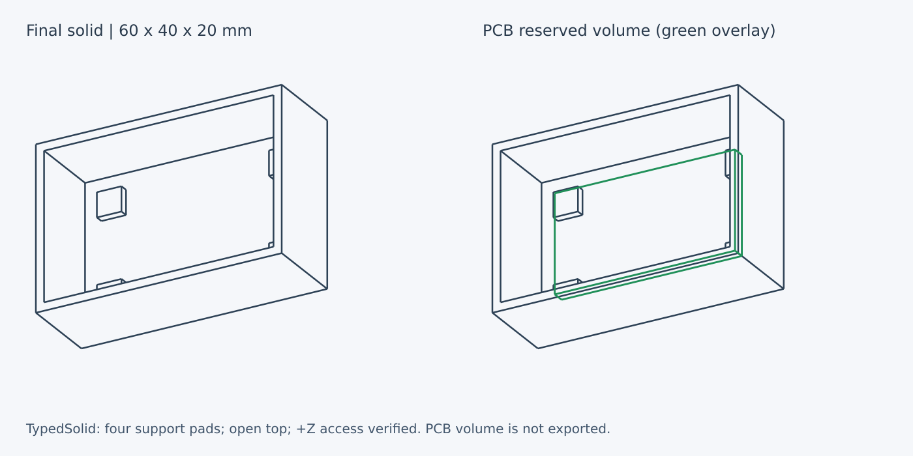

# 開発・実行

## 対象環境

初期検証対象はLinux x86_64 / CPython 3.12、Rust 1.97.1。Rust、Python packageはproject専用ディレクトリに配置する。Nixは必須ではない。Nix経路は下記の固定環境を使用する。

## セットアップ

Python 3.12、uv、C compiler、make、curl、tar、xzを用意する。uvは環境の既存ツールを使用し、この手順はglobal installを行わない。Python依存の正確な版・hashは`requirements-dev.lock`、Rust依存は`Cargo.lock`に固定する。

Linux x86_64でRustが未導入の場合、次を実行する。公式配布archiveのSHA-256を照合し、`.work/toolchain`にだけ導入する。再実行時はdownload済みarchiveを検証して再利用する。

```bash
bash scripts/bootstrap-rust.sh
uv venv --python python3.12 .venv
uv pip sync --python .venv/bin/python --require-hashes --only-binary :all: requirements-dev.lock
make check
```

既存のrustupを使う場合はbootstrapを省略できる。`rust-toolchain.toml`の固定版を使用する。`make`は`.work/toolchain/bin`があれば優先する。Pythonだけの代替ルール実装や、native moduleがない場合の自動fallbackは用意しない。

## Nix / Podman環境

`shell.nix`は[sabas0ba/dotfiles](https://github.com/sabas0ba/dotfiles/tree/2d272319883e37b7213b2910b1036fad751238cc)の固定nixpkgs `597283ad8aa0b331c788e97c4c262d58877074ef`と同じsource hashを使う。dotfilesのsoftware profileはRust 1.95.0 / Python 3.13のため、そのまま本projectの検証環境には使わない。Rustは既存component hashから1.97.1を構築し、Python 3.12とCAD wheel用共有libraryをNixで用意する。Rust配布物のELF interpreter/RPATHはNixのautoPatchelfHookで調整する。Nix storeは専用コンテナ内、Python環境は`.venv/`、cacheと一時データは`.work/`に置く。

依存取得の承認と調査後、Linux x86_64の独立したcheckoutで実行する。

```bash
nix-shell
python3.12 scripts/audit-dependencies.py > .work/dependency-audit.json
bash scripts/setup-nix-python.sh
make check
python examples/mounting_plate.py --output .work/mounting-plate
```

`setup-nix-python.sh`はhash固定wheelのみをcopyで配置する。maturinが動的リンクの場合だけvenv内のELF interpreterを調整し、uv cacheは変更しない。通常Linux向けbootstrapをこのNix checkoutに重ねて実行しない。`make`は既存の`.work/toolchain`を優先するためである。

Windowsではホストcheckoutをmountせず、専用コンテナ内にcheckoutを置く。使用したベースイメージはdotfilesのDockerfileと同じdigest固定版である。

```powershell
podman run -d --name typedsolid-dev --pull=never --cap-drop=ALL --security-opt=no-new-privileges docker.io/nixos/nix@sha256:377d4887aca98f0dfa12971c1ea6d6a625a435d8b610d4c95a436843da6fbfd1 sleep infinity
```

この例は承認の上でイメージ取得済みであることを前提とする。リポジトリは`/root/repos/typedsolid`へ取得し、feature branchで作業する。private repositoryの認証情報はコンテナへ持ち込まず、承認済みのホスト側GitHub取得経路からソースを転送する。転送したソースと元commitのGit tree SHAを照合する。host checkoutのコピーやmountは不要である。

コンテナ内でのNix実行は`nix-shell --option build-users-group '' shell.nix`とする。この設定は当該コンテナのコマンドに限定し、ホストのNix設定は変更しない。Nixイメージのsandbox無効設定と組み合わせ、認証情報・ホストmount・deviceを持たない専用環境で使用する。

## 穴付きbossの作例

```bash
make python-build
.venv/bin/python examples/mounting_plate.py --output .work/mounting-plate
```

40×30×2 mmの底板に半径3 mm・高さ6 mmの円柱を4個配置する。円柱底面はz=1 mm、底板との重なりは1 mm。半径1.2 mmの円柱Cutをz=-1から8 mmまで通し、底板とbossを貫通する。各bossの上端はz=7 mmである。出力はSTL、STEP、意味モデル、検査report。寸法は説明用で、ねじ仕様や実基板catalogへの対応は含まない。

```python
from typedsolid import Cylinder, Feature

boss = Feature("boss", Cylinder((6, 6, 1), radius_mm=3, height_mm=6), role="mount")
hole = Feature("hole", Cylinder((6, 6, -1), radius_mm=1.2, height_mm=9), operation="cut")
```

円柱の直径と高さは入力・primitive寸法検査の対象となる。加工後の肉厚・接続部強度・印刷可否は未評価であり、それらを必須にした場合は出力を拒否する。面取り、任意軸、座標変換、ねじ規格、STL manifold検査は未対応。

## 検証

```bash
make rust-check    # fmt / clippy / Rust tests
make python-test   # native module build / Python integration tests
make check         # 両方
make example       # .work/board-tray に出力。既存なら拒否
```

Rust unit testはcoreを対象とする。PyO3 bindingはPythonからnative moduleを読み込む統合testで検証し、libpythonをリンクするembedding用Rust testとは分離する。bindingもworkspace全体のclippy検査に含める。

別の出力先を使う場合:

```bash
.venv/bin/python examples/board_tray.py --output .work/board-tray-v2
```

出力は`board_tray.stl`、`board_tray.step`、`model.json`、`report.json`。STLは1部品分。作例は60×40×20 mm、底・壁厚2 mm、4個の支持padを持つトレイである。44×24×3 mmの説明用基板領域をz=4 mmに確保し、+Zへ抜けることを検査する。支持面接触のためclearance=0を明示し、壁との間隔は6 mm以上設ける。基板固定機構・実基板寸法・ネジ穴はまだ含まないため、完成した実機筐体ではない。



濃色の線が出力対象、緑色がSTLに含まれない基板確保領域である。previewは最終CadQuery shapeにOCCTの隠線処理を適用して生成する。+Zアクセスは検査結果としてreport.jsonに記録する。

```bash
.venv/bin/python scripts/render-example.py --output .work/board-tray.svg
```

文書掲載のPNGはこのSVGを既存のInkscapeで変換したもの。PNG変換は任意で、Inkscapeを通常の開発依存には含めない。

API使用例:

```python
from typedsolid import Box, Feature, Model, Part
from typedsolid.cadquery import export

model = Model(parts=(Part("plate", (
    Feature("base", Box((0, 0, 0), (40, 30, 2)), role="base"),
)),))
print(model.preflight())
export(model, ".work/plate")
```

全座標はmm。`Feature(operation="cut")`は全Addを結合した後に差し引く。最終肉厚やサポート不要を必須にする場合は`Policy.required`に該当ルールを追加するが、現在は未実装なのでexportが拒否される。

## 依存更新

更新前に [依存調査](dependencies.md) を行う。承認後、cutoffを公開後7日以上となる日付に指定する。lockfileを削除して検査を回避しない。

```bash
uv pip compile --no-config --exclude-newer 2026-08-29 --generate-hashes --only-binary :all: requirements-dev.in -o requirements-dev.lock
make audit
make check
```

Rustのtransitive依存更新も`Cargo.lock`を差分レビューし、auditに含める。外部advisory照合はnetworkを必要とするため、通常のunit testと分離する。

## CI方針

PRはLinux上の軽量core検査、main更新・手動実行はCadQuery統合テストを含む検査を行う。CadQueryはVTK等の大きな依存を持つため、通常のPRごとに取得・統合buildを強制しない。初回PRはローカルの統合テスト結果を添付する。Windows/macOS jobと自動publishは追加しない。

## 作業データ

`.work/`、`.venv/`、`target/`はgit管理外。生成済み出力を消さずに再評価する場合は別名の出力ディレクトリを使用する。開発環境全体を再構築する前に、`.work/`内の必要な作例を退避する。
