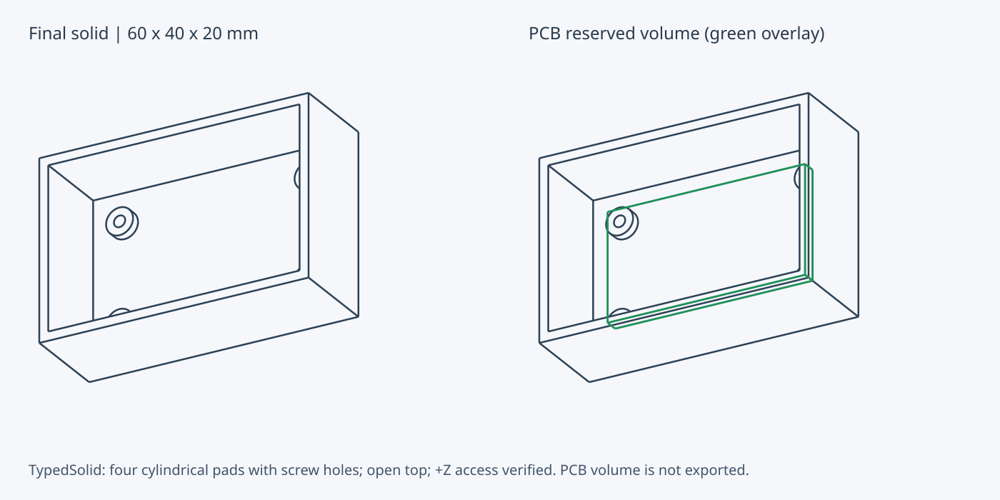
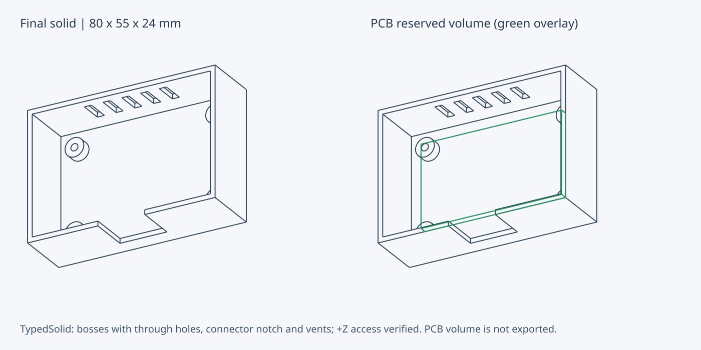

# 開発・実行

## 対象環境

初期検証対象はLinux x86_64 / CPython 3.12、Rust 1.97.1。Rust、Python packageはproject専用ディレクトリに配置する。Nixは必須ではなく、後述の2経路のいずれでも同じ`make check`を実行できる。Dockerを用いた環境と他OSの検証は後続項目である。

## セットアップ (Nix)

`nix develop`はrust-toolchain.tomlの指定どおりのRust toolchain、Python 3.12、uv、C compiler、poppler-utilsを提供する。`.envrc`があるためdirenvでも入れる。

```bash
nix develop
uv venv --python python3.12 .venv
uv pip sync --python .venv/bin/python --require-hashes --only-binary :all: requirements-dev.lock
make check
```

flake inputは`flake.lock`にrevisionとnarHashで固定する。Rust toolchainはfenixがRust公式のrustup manifestから構成し、`flake.nix`の`sha256`が内容を固定する。取得元と版は`scripts/bootstrap-rust.sh`と同一である。

開発シェル内で`scripts/bootstrap-rust.sh`を実行しない。`.work/toolchain`が残っている場合、Makefileはそちらを優先するため、不要なら削除する。

`.venv`は作成時のinterpreterへの参照を持つ。開発シェル内で作成した`.venv`はNixのinterpreterを指し、シェル外ではcadquery-ocpが必要とする共有ライブラリを解決できない。経路を切り替える場合は`.venv`を削除して作り直す。

提供するsystemはx86_64-linuxのみである。他のsystemはtoolchainのhashを検証していないため定義しない。

## セットアップ (Nixを使わない場合)

Python 3.12、uv、C compiler、make、curl、tar、xzを用意する。uvは環境の既存ツールを使用し、この手順はglobal installを行わない。Python依存の正確な版・hashは`requirements-dev.lock`、Rust依存は`Cargo.lock`に固定する。

Linux x86_64でRustが未導入の場合、次を実行する。公式配布archiveのSHA-256を照合し、`.work/toolchain`にだけ導入する。再実行時はdownload済みarchiveを検証して再利用する。

```bash
bash scripts/bootstrap-rust.sh
uv venv --python python3.12 .venv
uv pip sync --python .venv/bin/python --require-hashes --only-binary :all: requirements-dev.lock
make check
```

既存のrustupを使う場合はbootstrapを省略できる。`rust-toolchain.toml`の固定版を使用する。`make`は`.work/toolchain/bin`があれば優先する。Pythonだけの代替ルール実装や、native moduleがない場合の自動fallbackは用意しない。

## 検証

```bash
make rust-check    # fmt / clippy / Rust tests
make python-test   # native module build / Python integration tests
make check         # 両方
make example       # .work/board-tray に出力。既存なら拒否。cacheは.work/cache
make clean-cache   # 生成cacheを消す
```

Rust unit testはcoreを対象とする。PyO3 bindingはPythonからnative moduleを読み込む統合testで検証し、libpythonをリンクするembedding用Rust testとは分離する。bindingもworkspace全体のclippy検査に含める。

`tests/test_enclosure_fixtures.py`は、開口を持つ筐体に既知の欠陥を1つずつ入れ、落ちるruleの集合が宣言と完全に一致することを見る。個々のruleは単純形状のtestが検証しており、ここで確かめるのは実形状での成立と過検出の不在である。詳細は [ロードマップ](roadmap.md) を参照する。

別の出力先を使う場合:

```bash
.venv/bin/python examples/board_tray.py --output .work/board-tray-v2
```

出力は`board_tray.stl`、`board_tray.step`、`model.json`、`report.json`。STLは1部品分。作例は60×40×20 mm、底・壁厚2 mmのトレイで、収める基板は [部品catalog](catalog.md) のRaspberry Pi Pico 2である。catalogの取付穴位置にφ5 mmの支持pad 4個を立て、φ1.6 mmのネジ下穴で貫く。Pico 2の取付穴はφ2.1でM2相当である。基板の51×21 mmの領域をz=4 mmに確保し、+Zへ抜けることを検査する。支持面へ接触させるため下面のclearanceだけを0とし、他の面は0.5 mmを確保する。データシートは部品高さを与えないため、確保する高さ5 mmは作例側で決めている。ネジ・インサートの仕様と蓋は含まないため、完成した実機筐体ではない。



濃色の線が出力対象、緑色がSTLに含まれない基板確保領域である。previewは最終CadQuery shapeにOCCTの隠線処理を適用して生成する。+Zアクセスは検査結果としてreport.jsonに記録する。

```bash
.venv/bin/python scripts/render-example.py --output docs/assets/board-tray.svg
```

作例を変更した場合はSVGを再生成する。ラスタ画像は変換ツールを開発依存に加えることになるため用意しない。

### 開放筐体の作例

`examples/electronics_enclosure.py`は80×55×24 mm、床・壁厚2 mmの上面開放の筐体を生成する。床から立つφ8 mmのboss 4個を上面z=6 mmの支持面とし、φ3 mmの穴で床とbossを貫く。前面にz=7 mmから上端までの幅20 mmのコネクタ用切り欠き、背面に3×10 mmの通気スリット5本を開ける。60×35×3 mmの基板領域をbossの上に確保し、+Zへ抜けることを検査する。寸法は説明用で、特定の基板やコネクタの仕様ではない。

前面の開口は上端まで開けた切り欠きとしている。上端を閉じた窓にすると上辺が幅20 mmのbridgeとなり、既定の`bridge_max_mm` (5 mm) で`support_free`が落ちる。使用する印刷機がそれ以上を渡せることを確かめた場合は、`Policy(bridge_max_mm=...)`で指定して窓にできる。

```bash
.venv/bin/python examples/electronics_enclosure.py --output .work/electronics-enclosure
.venv/bin/python scripts/render-example.py --example electronics_enclosure --output docs/assets/electronics-enclosure.svg
```



`tests/test_e2e.py`はこの作例を公開CLIとして子processで起動し、次を検証する。

- 出力4 fileの生成と、report.jsonに記録したdigestとの一致
- 必須ruleがすべてpassであり、未評価が`strength`と`thermal`だけであること
- STEPを再読込した形状が単一の有効なsolidで、外形寸法と体積が設計値と一致すること
- 穴、切り欠き、スリットの位置に材料がなく、その脇に材料が残っていること
- STLの座標が有限で、外形が設計値と一致すること
- 既存の出力先へ再実行した場合に拒否し、既存の出力を変えないこと

slicer、実機印刷、強度・放熱はこのtestの対象外である。

API使用例:

```python
from typedsolid import Box, Feature, Model, Part, hole
from typedsolid.cadquery import export

model = Model(parts=(Part("plate", (
    Feature("base", Box((0, 0, 0), (40, 30, 2)), role="base"),
    hole("bore", "z", (20, 15), 3.0, (-1, 3)),
)),))
print(model.preflight())
export(model, ".work/plate")
```

全座標はmm。`Feature(operation="cut")`は全Addを結合した後に差し引く。`hole`は`cut`のcylinder、`boss`は`add`のcylinderを作るhelperで、いずれも直径で指定する。応力・熱を必須にする場合は`Policy.required`に該当ルールを追加するが、現在は未実装なのでexportが拒否される。

分解手順は`Assembly`に書く。記述した位置を組立完了の状態とし、stepを上から順に実行する。

```python
from typedsolid import Assembly, Model, Move, Step

model = Model(
    parts=(tray, lid),
    assembly=Assembly(
        steps=(Step("open_lid", ("lid",), (Move("minus_x", 4.0), Move("plus_z"))),),
        fit_clearance_mm=0.2,
    ),
)
```

工具・ケーブル・コネクタの通り道と、keepoutの取り出しは`Sweep`に書く。`after_step`を与えると、そのstepを終えた状態で評価する。

```python
from typedsolid import Box, Cylinder, Sweep

sweeps = (
    # 蓋を閉じたまま、右壁の開口へUSBプラグを差し込む。
    Sweep("usb_plug", "minus_x", shape=Box((42, 11, 6), (55, 19, 9)), distance_mm=10.0),
    # 蓋を外した後、ネジ受けの真上からドライバを抜き差しする。
    Sweep("driver", "plus_z", shape=Cylinder("z", (10, 15), 1.5, (8, 12)), after_step="open_lid"),
    # 蓋を外した後、基板を上へ抜く。
    Sweep("pcb_out", "plus_z", keepout="pcb", after_step="open_lid"),
)
```

keepoutは分解経路の障害物になる。基板が部品に固定されている場合は`attached_to`でその部品を示すと、分解stepで部品と一緒に動く。

```python
from typedsolid import Box, Clearance, Keepout, Move, Step

# 引き出し (tray) に載った基板。引き出しを前へ抜くと基板も一緒に出る。
pcb = Keepout("pcb", Box((8, 8, 4), (32, 32, 10)), Clearance(default=0.5, minus_z=0.0), attached_to="tray")
pull = Step("pull_tray", ("tray",), (Move("minus_y"),))
```

catalogの`board.keepout(..., attached_to="tray")`でも指定できる。取付先を省いたkeepoutは外部に固定されたものとして最後まで残り、そこを通る分解経路は`disassembly_path`で落ちる。

`Keepout(access=("plus_z",))`は、組立完了の状態で外まで抜く`Sweep("pcb_plus_z", "plus_z", keepout="pcb")`の省略形である。

`Move("plus_z")`は残っている部品の外まで動かす。数値を与えるとその距離だけ動かす。`disassembly_path`は各区間の干渉を、`disassembly_separation`は最後の方向へ動かし続けて外れることを検査する。

ネジ固定は`screw_fixing`で作る。ネジとインサートの寸法は規格表や実測から与え、`source`に出典を書く。返り値のfeatureを各部品に加え、掃引と`Fastener`をモデルに渡す。

```python
from typedsolid import Box, Feature, Model, Part, ScrewSpec, screw_fixing

m2 = ScrewSpec("m2x8_tapping", "手持ちのネジの実測", length_mm=8.0, major_mm=2.0,
               head_mm=3.8, through_mm=2.4, driver_mm=3.0, pilot_mm=1.6)
# 蓋 (z=10〜12) を上から、床から立つφ6のbossへ締める。
corner = screw_fixing(
    "corner_a", m2, base="tray", clamp=("lid",), direction="minus_z", center=(6.0, 6.0),
    seat_mm=12.0, joint_mm=10.0, boss_diameter_mm=6.0, boss_from_mm=0.0,
    tip_clearance_mm=1.0, min_engagement_mm=4.0, min_boss_wall_mm=1.5,
)
tray = Part("tray", (Feature("floor", Box((0, 0, 0), (40, 30, 2))),) + corner.base_features)
lid = Part("lid", (Feature("panel", Box((0, 0, 10), (40, 30, 12))),) + corner.clamp_features)
model = Model(parts=(tray, lid), sweeps=(corner.sweep,), fasteners=(corner.fastener,))
```

ネジを外す手順がある場合は`release=Release("open_lid")`のように外す状態を与える。蓋を外すstepより前に外すなら`Release()` (組立完了の状態) とする。省くとネジは外さないものとして扱い、ネジで留めた部品を引き離す分解stepがあると`fastener_release`が落ちる。基板をネジで締める場合は`clamp_keepouts=("pcb",)`で基板のkeepoutを示す。

熱圧入インサートを使う場合は`insert=InsertSpec(name, source, hole_mm, length_mm)`を与える。インサートは境目と面一に埋め、下穴はネジの先端と`tip_clearance_mm`の分まで延ばす。検査項目は [設計](design.md#ネジ固定の検査) を参照する。

材料と印刷機の値は`Profile`にまとめ、`Policy`と`Assembly`を作る。材料はIRの`Material`として`Model.materials`に渡し、部品の`material`で参照する。印刷機と設計値はIRに現れない。値はすべて必須で、既定値はない。

```python
from typedsolid import Material, Printer, Profile

profile = Profile(
    material=Material("pla_a", "PLA lot A", "社内の曲げ試験記録", allowable_strain=0.02),
    printer=Printer("printer_a", nozzle_mm=0.4, layer_mm=0.2, fit_clearance_mm=0.2),
    min_wall_mm=1.6, min_neck_mm=2.0, min_feature_mm=0.8,
    overhang_angle_deg=45.0, bridge_max_mm=5.0, build_direction="plus_z",
)
lid = Part("lid", lid.features, material=profile.material.id)
model = Model(parts=(tray, lid), policy=profile.policy(voxel_mm=0.4),
              assembly=profile.assembly(steps), sweeps=(corner.sweep,),
              fasteners=(corner.fastener,), materials=(profile.material,))
```

snap fitは`snap_fit`で作る。梁の根元の面の中心、長さ、厚み (たわむ向き)、幅、フックの張り出しと長さを与えると、梁とフックのfeatureと`SnapFit`を返す。フックは外すときにたわむ向きと反対の側に付く。梁を持つ部品には`allowable_strain`を持つ材料を割り当てる。

```python
from typedsolid import Assembly, Box, Feature, Model, Move, Part, Step, snap_fit

# 蓋の下面 (z=30) から垂れる梁。先端のフックが右壁の爪の下に掛かり、-Xへたわませて外す。
clip = snap_fit(
    "clip_right", part="lid", mate="tray", step="open_lid", root=(35.25, 10.0, 30.0),
    length_direction="minus_z", deflection="minus_x", length_mm=20.0, thickness_mm=1.5,
    width_mm=10.0, hook_mm=1.0, hook_length_mm=2.0,
)
panel = Feature("panel", Box((0, 0, 30), (40, 20, 32)))
lid = Part("lid", (panel,) + clip.features, material=profile.material.id)
model = Model(parts=(tray, lid), policy=profile.policy(build_direction="plus_y"),
              assembly=Assembly((Step("open_lid", ("lid",), (Move("plus_z"),)),)),
              materials=(profile.material,), snap_fits=(clip.snap,))
```

梁の長さ方向を印刷方向と平行にすると`layer`が落ちる。この例では梁が縦に立つため、印刷方向を`plus_y`とし、蓋を横倒しで印刷する想定にしている。検査項目は [設計](design.md#snap-fitの検査) を参照する。

収める基板が [部品catalog](catalog.md) にある場合は、外形と取付穴を手で書かずにcatalogから取れる。

```python
from typedsolid import board

pico = board("raspberry_pi_pico_2")
pads = pico.bosses((0.0, 4.0), 5.0, origin=(4.5, 9.5, 4.0))
```

コネクタ開口は`connector_opening`で作る。プラグ断面の寸法は組み込まれていないため、使うケーブルの部品datasheetの値か実測値を、出典とともに与える。コネクタの辺上の位置は、資料が寸法化した基板ならcatalogから取れる。

```python
from typedsolid import PlugSource, board, connector_opening

pi = board("raspberry_pi_4_model_b")
origin = (3.0, 4.0, 5.0)                                  # 基板左下角。PCB下面がz=5.0
front = pi.edge_position("minus_y", origin)              # 基板の下辺のy座標
power = connector_opening(
    "power", part="case", direction="minus_y",            # プラグを-yへ抜く
    center=pi.connector_center("usb_c_power", origin, z_mm=8.2),   # z_mmはプラグ中心の高さ (例示の値)
    plug_mm=(12.4, 6.6),                                  # プラグ外形 (x, z)。例示の値で、実物を測って与える
    plug_span=(front - 3.0, front + 6.0),                 # 嵌合状態でプラグが占めるy範囲
    wall_span=(front - 4.5, front - 1.5),                 # 前壁のy範囲
    clearance_mm=0.4,
    source=PlugSource("measured", "USB-C cable in use, caliper, overmold max"),
)
# power.featureを前壁の部品へ、power.sweepとpower.connectorをModelへ加える。
```

`connector_fit`は開口と掃引とプラグ寸法の整合を、`access_clearance`は抜く経路上の干渉を見る。縦の壁の開口は上縁がbridgeになるため、幅が`bridge_max_mm`を超えると`support_free`が落ちる。詳細は [設計](design.md#コネクタ開口の検査) を参照する。

最終肉厚・接続部断面・閉空洞・支持の要否はIRをrasterizeして判定する。格子は`Policy.voxel_mm` (既定0.2 mm) で、細かいほど正確になり、cell数は3乗で増える。作例 (60×40×20 mm) では0.2 mmで約5秒、0.4 mmで約0.6秒かかる。大きなモデルを扱う場合は格子を粗くする。

印刷姿勢は`Policy.build_direction` (既定`plus_z`)、支持なしで許す傾斜は`overhang_angle_deg` (既定45)、渡せる未支持区間の長さは`bridge_max_mm` (既定5.0) で指定する。

## 外部形状の検査

既存の筐体など、IRで記述していないSTL (binary又はASCII) とSTEPにも、最終形状の4 rule (肉厚、断面、閉空洞、支持) を適用できる。単位はmmとみなす。閉じていないmeshは評価せず拒否する。

```bash
.venv/bin/python -m typedsolid.external path/to/case.stl
.venv/bin/python -m typedsolid.external path/to/case.step --min-wall-mm 1.0 --build-direction plus_y --json
```

すべてpassなら終了コード0、failがあれば1を返す。Pythonからは`typedsolid.external.inspect_file(path, policy)`で同じ結果を得る。第三者のファイルはリポジトリに置かず、`.work/`など管理外の場所に取得する。比較の手順と結果は [既存ケースとの比較](comparison.md) を参照する。

`--figures DIR`を与えると、概観と検出箇所の断面図をDIRへ書く。

## 検出箇所の図

`export`は出力先の`figures/`に、部品ごとの概観と、failしたcheckの検出箇所を通る3断面のSVGを書く。report.jsonの各checkの`locations`は、図と同じ検出箇所のboxである。

```python
from typedsolid.cadquery import export

try:
    export(model, ".work/case")              # 合格なら .work/case/figures/ に概観図
except ValueError as error:
    print(error.__notes__)                   # 拒否なら .work/case.rejected/ に report.json と図
```

拒否した場合、出力先は作らず、reportと図だけを`<出力先>.rejected/`に書く。図が不要なら`export(..., figures=False)`とする。欠陥fixtureの図は、CadQueryを使わずRust coreの検査だけから次で描ける。

```bash
.venv/bin/python scripts/render-figures.py --output .work/figures
```

図の読み方と各ruleの検出箇所の定義は [設計](design.md#検出箇所と図) を参照する。

## slicerとの突合

`support_free`は幾何のみに基づく近似であり、ノズル径、層厚、冷却、材料を含まない。実機で用いる場合は、出力したSTLをslicerへ読み込み、同じ印刷姿勢でサポート生成の要否を比較する。

```bash
make example
# .work/board-tray/board_tray.stl をslicerで開き、build_directionと同じ向きに置く
# サポート自動生成を有効にし、生成箇所がreport.jsonのsupport_freeと矛盾しないか確認する
```

slicerは開発依存に含めず、CIでも実行しない。突合は手元での確認とし、判定が食い違った場合は`overhang_angle_deg`と`bridge_max_mm`を実機の条件に合わせる。

## 依存更新

更新前に [依存調査](dependencies.md) を行う。承認後、cutoffを公開後7日以上となる日付に指定する。lockfileを削除して検査を回避しない。

```bash
uv pip compile --no-config --exclude-newer 2026-08-29 --generate-hashes --only-binary :all: requirements-dev.in -o requirements-dev.lock
make audit
make check
```

Rustのtransitive依存更新も`Cargo.lock`を差分レビューし、auditに含める。外部advisory照合はnetworkを必要とするため、通常のunit testと分離する。

## CI方針

PRはLinux上の軽量core検査、main更新・手動実行はCadQuery統合テストを含む検査を行う。CadQueryはVTK等の大きな依存を持つため、通常のPRごとに取得・統合buildを強制しない。初回PRはローカルの統合テスト結果を添付する。Windows/macOS jobと自動publishは追加しない。

core検査は、欠陥fixtureの断面図をCadQueryを使わずに再生成し、`docs/assets/figures/`の図と一致することも確かめる。Python環境にはmaturinだけを`requirements-figures.lock`から入れる。検出箇所の表はjob summaryに書く。図を変える変更では`scripts/render-figures.py --output docs/assets/figures --defects-only`で再生成してcommitし、PR本文から参照する。artifactのupload用actionは依存を増やさないため使わない。

## 打ち切りと再開

`export`は既定で子processにbackendを隔離し、`timeout_s` (既定600秒) を超えると`WorkerTimeout`を送出する。呼び出し元のscriptは子で読み込み直さないため、`if __name__ == "__main__"`による保護は不要で、notebookや標準入力からも呼べる。出力先は作られず、stagingも残らない。進行は`progress`に渡した関数へ、経過秒付きの段階名で届く。

```python
import sys
from typedsolid.cadquery import export

export(model, ".work/out", timeout_s=120, cache_dir=".work/cache",
       progress=lambda stage: print(stage, file=sys.stderr))
```

```
[    0.1 s] part board_tray: building shape
[    0.3 s] keepout and interference checks
[    0.3 s] part board_tray: voxel evaluation
[    7.5 s] part board_tray: writing stl
```

`cache_dir`を与えると、部品ごとの形状とvoxel評価を保存し、再実行では変わっていない部品を再利用する。打ち切られた実行も、完了した部品の分だけ次回が短くなる。作例は`.work/cache`を使い、cacheなしで約12秒、cacheありで約4.5秒かかる。残りは親子2つのprocessでのcadquery読み込みである。

```bash
make clean-cache   # .work/cache/typedsolid-v1 の項目だけを消す
```

cacheのkeyはbackendのsourceとnative moduleを含むため、コードを変更すると古い項目は使われずに残る。容量が気になれば消す。書き込みは一時fileのrenameで行い、読み出し時にdigestを照合するため、中断で壊れた項目は使われない。

`export(..., isolated=False)`は同一processで実行し、`timeout_s`を使わない。debuggerでbackendを追う場合と、`unittest.mock.patch`でbackendを差し替えるtestに使う。

## 作業データ

`.work/`、`.venv/`、`target/`はgit管理外。生成済み出力を消さずに再評価する場合は別名の出力ディレクトリを使用する。開発環境全体を再構築する前に、`.work/`内の必要な作例を退避する。
